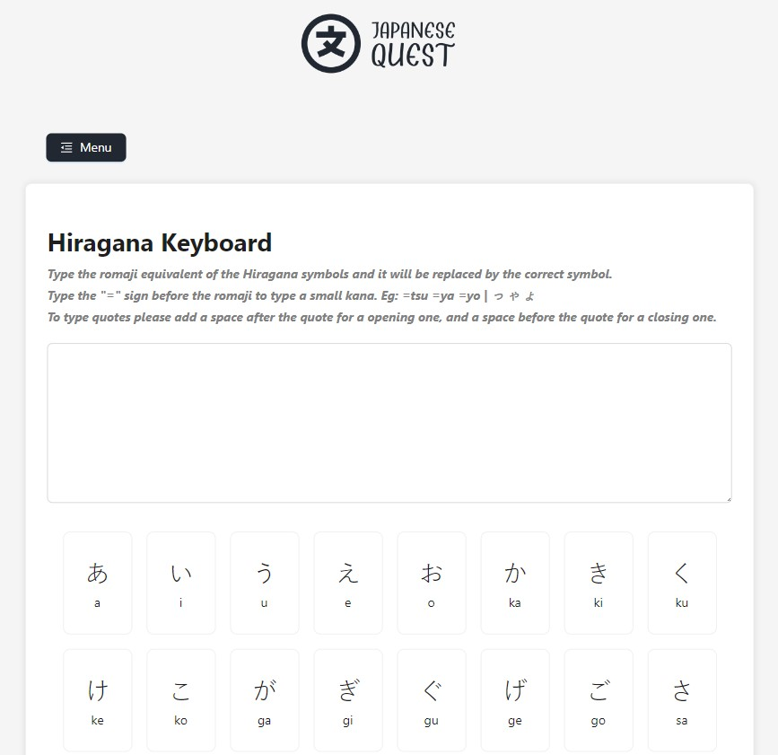

## Project Motivation

In 2023 I decided to take a trip to Japan since this was a long life dream of mine. In order to arrive at the country with at least some language knowledge, I also decided to start taking Japanese classes.

I've discovered that Japanese has 3 alphabets (4 if you include romaji, which is our alphabet), and it is a nightmare to remember all those symbols.

So, the idea of the app is to help me (and other people) train and remember all those symbols from the Japanese alphabets.

[Click here to go to the app](https://japanese.platiplus.dev)

## Screens

The quiz screen consists of a central card that will present you a symbol from the Japanese alphabet, to this date, we only have Hiragana.

You'll have to type the "romaji" equivalent of that symbol, and if you get it right, you will be presented with a button to go to the next one, until you complete the alphabet.

The glossary screen is a simple one, you have all the symbols (from Hiragana only up to now) and its equivalent in "romaji" so you can learn and remember them in case you forgot.

This is a really interesting screen. It is a full keyboard to write stuff in Hiragana. You have all the symbols there so you can click and write your words, but there's also something really cool about it.

If you write any word in "romaji" in the text area, it will be automatically translated to an equivalent hiragana symbol, so you can use it to type words in Japanese really fast instead of searching for the symbols or using a translator.

## Architecture

Architecture-wise there's nothing much to it. It's a simple SPA created using React.js and it is hosted on Netlify. The keyboard works thanks to React hooks to process the keystrokes and changing them using some regex.
