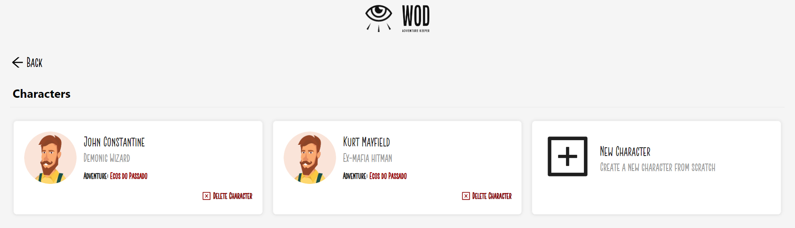
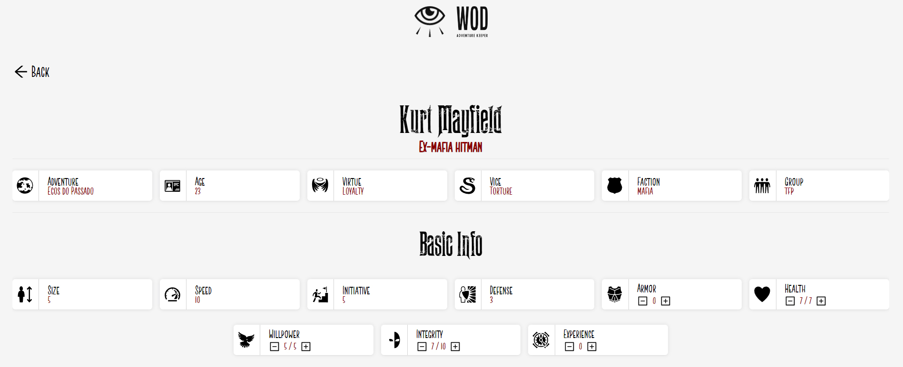
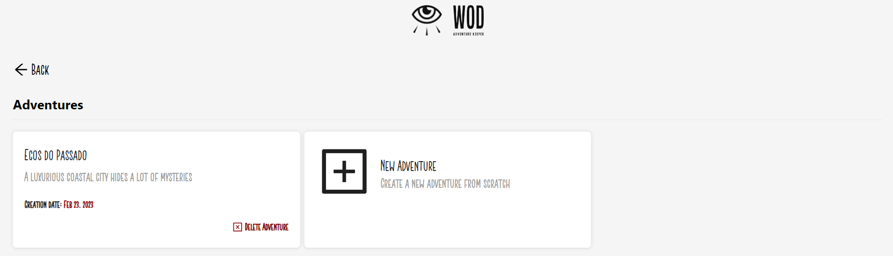
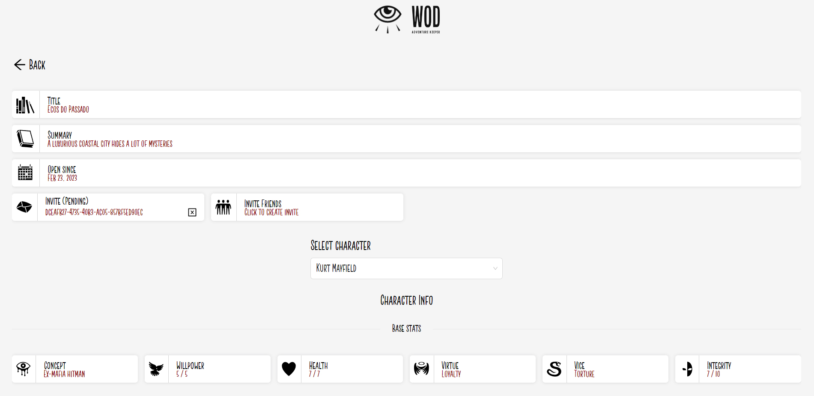
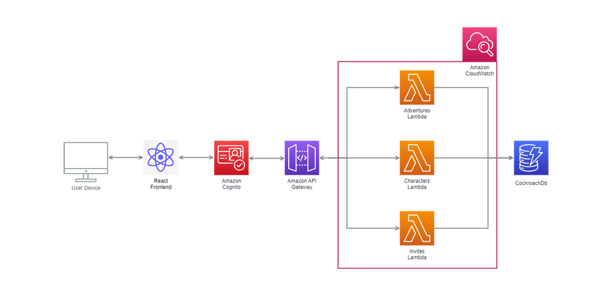

## Project Motivation

World of Darkness is a popular storytelling system that offers a rich and immersive experience to players. 

However, managing and tracking players’ characters, NPCs and adventures in this game can be challenging. 

That’s where “WoD - Adventure Keeper” comes in - to provide an easy-to-use platform to create and manage all the needs you might have while playing/narrating an adventure in the World of Darkness.

Adventure Keeper aims to eliminate the use of paper regarding playing/narrating and adventure. 

Your character sheets are kept in the cloud and can be accessed from any device that has a browser, so you can either play adventures remotely and use your computer or go to your friends’ houses and use your phone to check on your character and update its traits and statuses.

## Screens

From the character management perspective, you can have multiple characters on your roster and assign them to adventures created by you or by other players. In the character screen, you can see your rosters’ basic info, showcasing the name and the concept of your characters, having the possibility to enter a specific screen with their details that will be used throughout the adventure.

This specific screen will show your base statuses, items, merits, conditions, skills and other info you might need when your Dungeon Master ask for any specific tests when you play.

From the Dungeon Master’s perspective, you can create an adventure providing a name and a quick summary that will help you identify which adventure you need when choosing them on the adventure selection screen.

On the adventure details screen, you will have control over all the characters that are currently playing your adventure, being able to see their base stats and give/remove merits, conditions and items.

From this screen, you can also create invites to your adventure, and can send them to friends to accept from their character screen to be linked with your adventure.

### Architecture

---
Hosting - Netlify  
Frontend - React  
Backend - Api Gateway / Lambdas  
Database - CockroachDb  
Infrastructure - AWS CDK

---

The frontend of Adventure Keeper is a Single Page Application (SPA) powered by React.js and Redux. This combination allows for fast and responsive UIs, as well as the flexibility to build complex user interactions with ease. The SPA is hosted on Netlify, which provides an automated pipeline to seamlessly deploy the code from a GitHub repo.

For the backend, API Gateway and Lambdas are used to deal with specific entity related code. This allows for a more efficient use of resources, as each Lambda function can be optimized to handle a specific task, making them more scalable and easier to maintain. The API Gateway provides a simple and secure way to interact with the Lambdas, ensuring that data is handled safely and securely.

To store data, CockroachDB was selected since it is a scalable, fast, cheap and serverless database that uses PostgreSQL syntax. This choice provides the benefits of a traditional SQL database, with the added advantages of serverless architecture. CockroachDB’s also has a generous free tier offer that makes it a very attractive choice to build a web app on a budget.

Finally, all the infrastructure for this web app was created as code, using AWS CDK to build and version all resources. This approach allows for more consistent and repeatable infrastructure, making it easier to maintain and update the app over time. The use of Git for version control ensures that changes to the infrastructure can be tracked and managed more effectively.

To monitor the application, all the Lambdas are constantly writing logs to Amazon Cloudwatch. This provides developers with a powerful tool for monitoring the app, identifying issues and debugging problems.
